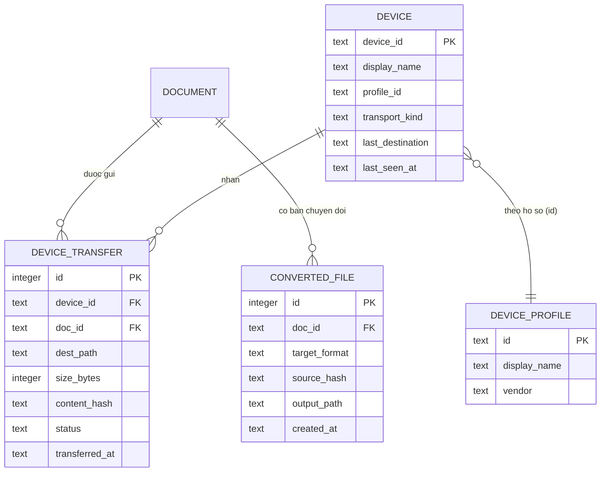

# 02 — Kiến trúc

Tài liệu này mô tả thiết kế, không chứa mã thực thi. Tên module/lớp là **đề xuất**; Claude Code được phép đổi nếu mã hiện có có quy ước tốt hơn, miễn là giữ nguyên ranh giới tầng và ghi lại quyết định.

## 1. Nguyên tắc

1. Giữ nguyên Clean Architecture hiện có: `core/` → `domain/` → `infrastructure/` → `application/` → `presentation/`, `app.py` là composition root.
2. Mọi lớp nhận `context: AppContext`; không tự dựng collaborator, không dùng singleton.
3. Phản ứng sự kiện đi qua `EventBus` và `QtEventBridge`; ghi DB qua `DatabaseManager`.
4. Không tải gì lúc khởi động. Thành phần mới khởi động muộn và trên luồng nền.
5. Mã riêng của nền tảng nằm sau giao diện trừu tượng (mục 9).
6. Chỉ thêm, không phá: bảng/cột mới, migration mới, hàm máy chủ tương thích ngược.

## 2. Vị trí module mới (đề xuất)

| Tầng | Module | Trách nhiệm |
|---|---|---|
| domain | `device_profile.py` | Mô hình hồ sơ thiết bị và kiểm hợp lệ (thuần, không I/O) |
| domain | `transfer_plan.py` | Quy tắc lập kế hoạch: trạng thái mục, kiểm dung lượng, va chạm tên, tương thích định dạng (hàm thuần) |
| domain | `filename_policy.py` | Làm sạch tên file, giới hạn độ dài, chuẩn hóa NFC, bỏ dấu tùy chọn |
| infrastructure | `devices/transport.py` | Giao diện `DeviceTransport` (mục 5) và các ngoại lệ |
| infrastructure | `devices/local_drive.py` | Bản hiện thực cho ổ đĩa/thẻ nhớ |
| infrastructure | `devices/mtp_windows.py` | Bản hiện thực MTP (chỉ khi spike đạt; S3c) |
| infrastructure | `devices/detector.py` | Liệt kê thiết bị, khớp với hồ sơ |
| infrastructure | `conversion/calibre_cli.py` | Chạy `ebook-convert` như tiến trình riêng |
| application | `device_manager.py` | Vòng phát hiện thiết bị → sự kiện |
| application | `device_sync_service.py` | Lập kế hoạch, thực hiện trên luồng nền, ghi lịch sử |
| application | `conversion_service.py` | Điều phối chuyển đổi, DRM, bộ nhớ đệm |
| application | `backup_service.py` | Sao lưu/khôi phục `library.db` |
| application | `relink_service.py` | Tìm lại file mất |
| application | `review_moderation_client.py` | Báo cáo review, đọc cờ cấu hình (phía client) |
| presentation | `device_panel.py`, `send_to_device_dialog.py`, `conversion_dialog.py`, `relink_dialog.py`, `report_review_dialog.py` | Giao diện (xem `03_UI_UX_SPEC.md`) |
| data | `src/smartdoc/data/device_profiles/*.json` | Hồ sơ đóng gói sẵn; thư mục người dùng trong dữ liệu ứng dụng ghi đè theo `id` |

Thư mục mới ngoài mã: `docs/legal/`, `docs/spikes/`, `docs/adr/`, `docs/handoff/`, `spikes/` (mã tạm của spike, không đóng gói).

## 3. Mô hình dữ liệu

Bảng mới tạo bằng thêm mới (không đổi bảng cũ). Cột mới trên bảng cũ chỉ được append theo quy tắc hiện có.

`DEVICE_PROFILE` là **dữ liệu JSON**, không nằm trong cơ sở dữ liệu. Bảng `devices` lưu thiết bị đã từng thấy (định danh ổn định, hồ sơ được gán, thư mục đích lần trước).

Cột bổ sung trên bảng tài liệu: trạng thái file (`present`/`missing`) và thời điểm kiểm tra cuối, phục vụ FR-OPS-04 (chỉ append; Claude Code kiểm tra cột tương đương đã có chưa).

### Schema versioning (FR-OPS-02)

- Dùng `PRAGMA user_version` làm số phiên bản schema. Danh sách migration có thứ tự, mỗi migration chạy một lần, trong giao dịch, sau khi đã sao lưu.
- `_migrate_add_missing_columns` **giữ nguyên**. Khung mới dùng cho bảng mới và cột mới từ nay về sau.
- Cơ sở dữ liệu 1.0.0 (chưa có `user_version`) được coi là phiên bản nền; test nâng cấp dùng bản `library.db` mẫu ở schema 1.0.0.

## 4. Hồ sơ thiết bị (JSON, mô tả trường)

| Trường | Ý nghĩa |
|---|---|
| `id` | Định danh duy nhất, ví dụ `boox-note-air4c` |
| `display_name`, `vendor` | Hiển thị |
| `match` | Quy tắc nhận diện theo từng transport (nhãn ổ đĩa, VID/PID USB, tên/kiểu MTP). **Giá trị thực lấy từ spike S3a**, không đoán |
| `transports` | Danh sách transport được hỗ trợ theo thứ tự ưu tiên |
| `books_dir` | Thư mục đích tương đối theo từng transport (giá trị từ spike; người dùng chọn lại được) |
| `supported_formats` | Định dạng đọc được, theo thứ tự ưu tiên |
| `filename_template` | Mẫu tên file (mặc định "tác giả - tựa") |
| `ascii_filenames` | Có bỏ dấu tiếng Việt khỏi tên file hay không |
| `max_filename_length` | Độ dài tối đa |
| `cover_handling` | `none` mặc định (máy tự tạo bìa) |
| `notes` | Ghi chú cho người đọc hồ sơ |

Quy tắc nạp: hồ sơ người dùng ghi đè hồ sơ đóng gói theo `id`; hồ sơ sai định dạng bị bỏ qua kèm cảnh báo trong nhật ký, không làm dừng ứng dụng. Thêm hồ sơ mới **không** đòi sửa mã.

Hồ sơ đóng gói sẵn ban đầu: `boox-note-air4c`, `boox-go6`, `boox-android-generic`, `removable-drive-generic`.

## 5. Hợp đồng `DeviceTransport`

| Thao tác | Mô tả |
|---|---|
| `enumerate` | Liệt kê thiết bị/volume đang kết nối kèm thông tin nhận diện |
| `free_space` | Dung lượng trống của đích |
| `list_dir` | Liệt kê thư mục đích (tên, kích thước) |
| `stat` / `exists` | Kiểm tra file có mặt và kích thước |
| `copy_in` | Chép một file lên thiết bị với tiến độ và hủy được |
| `rename` | Đổi tên trên thiết bị (khả năng tùy transport, khai báo qua thuộc tính) |
| `remove_own_partial` | Xóa **duy nhất** file dở do chính phiên chép hiện tại tạo |
| `capabilities` | Khai báo: hỗ trợ rename, chép có tiến độ, kiểm băm, giới hạn tên |

Lỗi: một ngoại lệ gốc `DeviceError`, con của nó gồm `TransportError`, `DeviceLostError`, `InsufficientSpaceError`, `DestinationNotWritableError`. Bắt đúng kiểu; `except Exception` chỉ dùng để cô lập một worker (quy tắc hiện có).

Ba bản hiện thực theo thời gian: ổ đĩa/thẻ nhớ (S3b), MTP (S3c, có điều kiện), mạng/OPDS (S5).

## 6. Sự kiện và luồng luồng

Sự kiện mới (frozen dataclass, hậu tố `Event`, trong `core/event_bus.py`):

| Sự kiện | Phát khi | Người nhận điển hình |
|---|---|---|
| `DeviceConnectedEvent` / `DeviceDisconnectedEvent` | Thiết bị xuất hiện/biến mất | Panel thiết bị, hộp thoại gửi, thanh trạng thái |
| `TransferProgressEvent` | Tiến độ (gộp ≤ ~5 lần/giây) | Hộp thoại gửi, thanh trạng thái |
| `TransferFinishedEvent` | Xong/hủy/lỗi | Hộp thoại gửi, panel |
| `ConversionProgressEvent` / `ConversionFinishedEvent` | Chuyển đổi | Hộp thoại chuyển đổi |
| `LibraryFilesMissingEvent` | Phát hiện file mất | Sidebar, hộp thoại relink |

Luồng: worker nền → `EventBus.publish()` → `QtEventBridge` → widget trên luồng GUI. Widget không được chạm chính nó trực tiếp từ callback subscriber. Worker không chạm SQLite hoặc đối tượng Qt ngoài quy tắc hiện có (`DatabaseManager` với `write_lock`).

## 7. Thực hiện gửi sách (thuật toán mô tả)

1. **Lập kế hoạch** (hàm thuần trên dữ liệu đã đọc): với mỗi tài liệu → xác định trạng thái: `will_copy`, `already_on_device` (theo lịch sử hoặc trùng tên + kích thước ở đích), `incompatible_format`, `name_conflict` (khác nội dung cùng tên), `insufficient_space`.
2. **Người dùng duyệt kế hoạch** rồi bấm bắt đầu. Không có gì được chép trước bước này.
3. **Mỗi mục:** kiểm tra lại đích tồn tại → chép sang tên tạm cùng thư mục (nếu `rename` được hỗ trợ) → kiểm kích thước (và băm nếu bật) → đổi tên về tên cuối → ghi `device_transfers` → phát tiến độ. Nếu transport không hỗ trợ đổi tên thì chép thẳng tên cuối và chỉ dọn **file dở do chính mình tạo** khi lỗi/hủy.
4. **Không bao giờ** xóa hoặc ghi đè file có sẵn trên thiết bị. Va chạm tên → đổi tên có hậu tố hoặc bỏ qua, do người dùng chọn ở bước xem trước.
5. **Hủy:** dừng ở ranh giới file (hoặc hủy giữa file và dọn file dở của mình). Rút thiết bị: đánh dấu các mục còn lại `not_copied`, báo tổng kết.
6. Tên file đích do `filename_policy` quyết định theo hồ sơ.

## 8. Thiết kế máy chủ review (Supabase) — S2

Tất cả thay đổi máy chủ nằm trong file **`002_*.sql` mới** (không sửa `001_*.sql`), tương thích ngược với ứng dụng 1.0.0. Mô tả bằng lời; Claude Code viết SQL.

- **Ẩn review:** thêm cột "đã ẩn" (kèm lý do, thời điểm) vào bảng review; chính sách `select` cho `anon` chỉ trả review chưa ẩn, nên client cũ cũng không thấy review bị ẩn. Cập nhật `review_stats` để bỏ review ẩn.
- **Báo cáo:** bảng báo cáo (review, băm danh tính người báo cáo, lý do, thời điểm), duy nhất theo (review, người báo cáo). Hàm `report_review` cùng cách băm token như `submit_review`; khi số người báo cáo khác nhau đạt ngưỡng thì tự ẩn.
- **Cờ cấu hình:** bảng khóa–giá trị, `anon` chỉ đọc: `reviews_enabled`, `banner_message`, `auto_hide_threshold`, các hạn mức.
- **Chặn:** bảng danh tính bị chặn (băm token), được `submit_review` kiểm tra.
- **`submit_review`:** thêm giới hạn tần suất theo băm danh tính, giới hạn độ dài nickname/nội dung, kiểm tra `reviews_enabled` và chặn; giữ nguyên chữ ký (tên và tham số) cho client 1.0.0; mã lỗi mới ánh xạ thành thông báo tiếng Việt.
- **Ràng buộc mới trên bảng cũ** dùng dạng không kiểm dòng cũ (không làm hỏng dữ liệu hiện có).
- **Xác minh trước khi thay đổi:** quyền `insert` trực tiếp của `anon` còn mở hay đã đóng (giả định #2 ở `00`); nếu còn mở thì đóng lại là điều kiện, nhưng chỉ sau khi xác nhận client 1.0.0 chỉ dùng `submit_review`.

**Giá trị mặc định đề xuất (chờ O10):** tự ẩn khi ≥ 3 người báo cáo khác nhau; ≤ 10 review/giờ và ≤ 30 review/ngày cho mỗi danh tính; nickname ≤ 30 ký tự; nội dung ≤ 2.000 ký tự. Tất cả đọc từ bảng cấu hình để đổi mà không cần phát hành lại.

**Phía client:** timeout ngắn (khoảng 5 giây), lưu đệm cờ cấu hình khoảng 10 phút, không chặn giao diện; máy chủ không truy cập được → thông báo "tạm thời không khả dụng".

**Kiểm duyệt:** sổ tay `docs/MODERATION_RUNBOOK.md` gồm các thao tác chạy trong trình soạn SQL của Supabase bằng quyền quản trị của chủ dự án (liệt kê review bị báo cáo, ẩn/hiện lại, chặn/bỏ chặn danh tính, xóa lạm dụng, kiểm tra hạn mức). **Khóa quản trị không bao giờ nằm trong mã hoặc repo.**

## 9. Ràng buộc đa nền tảng (D7)

Chưa hiện thực macOS/Linux, nhưng từ nay:

1. Đường dẫn dữ liệu, cấu hình, nhật ký lấy qua một điểm duy nhất (đánh giá dùng thư viện chuẩn hóa thư mục theo hệ điều hành, sau khi kiểm giấy phép); không rải `%APPDATA%` rời rạc.
2. `SecretStore` phải được kiểm tra: dựa vào cơ chế của hệ điều hành (ví dụ DPAPI trên Windows) hay khóa tự quản; ghi lại phương án cho hệ khác.
3. Nhận diện thiết bị/thư mục/ổ đĩa nằm sau `DeviceTransport` và `detector`; module Windows đặt tên `*_windows.py`, nạp muộn theo nền tảng.
4. Không dùng API chỉ có trên Windows ngoài các module `*_windows.py` (báo cáo kiểm kê ở S1-09).
5. Đóng gói (Inno Setup, PyInstaller spec) tách khỏi lõi.

## 10. Chuyển đổi định dạng (S4)

- `ConversionService` gọi `ebook-convert` (Calibre) như tiến trình con, có timeout, hủy được, đọc tiến độ; đầu vào là bản sao/đường dẫn file gốc chỉ đọc, đầu ra ghi vào thư mục riêng.
- Phát hiện Calibre: đường dẫn người dùng đặt → PATH → các vị trí cài đặt thường gặp. Không có thì trả trạng thái "chưa cài" (không phải lỗi).
- **DRM:** trước khi chuyển đổi, kiểm dấu hiệu DRM ở mức phát hiện để từ chối; không thử vượt qua; nếu Calibre tự từ chối vì DRM thì hiển thị thông báo tương ứng.
- Bộ nhớ đệm theo (tài liệu, định dạng đích, băm nguồn); băm nguồn đổi thì bản đệm cũ hết hiệu lực.
- Cấu hình mặc định giữ font nhúng của sách và không ép đổi font, phải kiểm bằng bộ mẫu tiếng Việt (FR-CNV-07).
- Ranh giới giấy phép: tiến trình riêng, không nhúng mã Calibre. Chờ luật sư xác nhận trong `05`.

## 11. Cấu hình (`AppConfig`, chỉ thêm trường)

`device_auto_detect`, `device_last_destinations`, `conversion_calibre_path`, `conversion_output_dir`, `conversion_add_to_library`, `disabled_cover_sources`, `backup_retention`, `update_check_enabled` (chờ O8), `ui_language` (S4). Không thêm trường chứa bí mật; nếu có thì đưa vào `_ENCRYPTED_FIELDS`.

## 12. Chiến lược kiểm thử

- `FakeTransport` (thư mục tạm, có thể mô phỏng: rút thiết bị, thiếu dung lượng, không hỗ trợ đổi tên, chậm) cho toàn bộ test của `device_sync_service`.
- Test thuần cho `transfer_plan` và `filename_policy` (tên tiếng Việt có dấu, ký tự cấm, tên dài, va chạm).
- Test nâng cấp schema từ `library.db` 1.0.0 mẫu; test sao lưu/khôi phục; test relink.
- Test máy chủ review dùng server giả; SQL kiểm chứng thủ công trên dự án Supabase riêng của chủ dự án (không dùng dự án thật khi chạy CI).
- Test phần cứng thật: đánh dấu bỏ qua được, chạy tay theo giao thức spike.
- Timing-based test phải ổn định trước khi đưa vào CI (S1-08).
