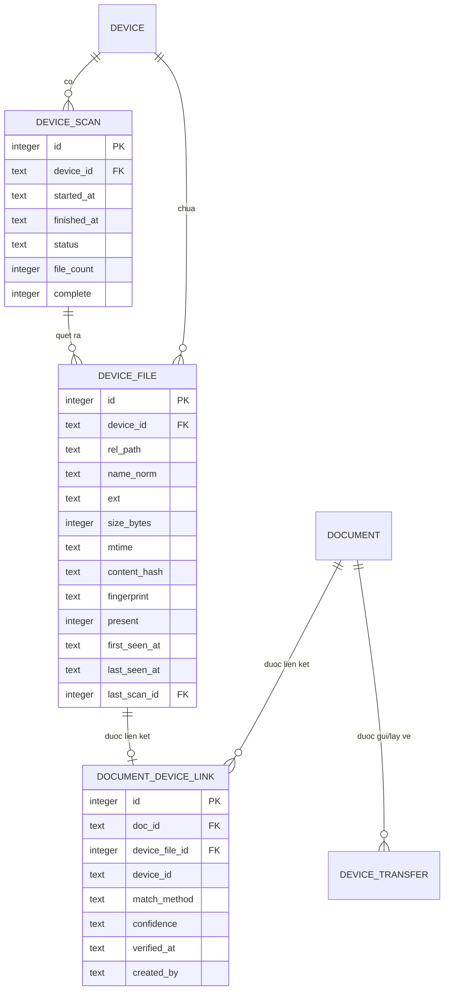

# 07 — Đồng bộ thư viện với máy đọc sách (Epic H)

- **Chặng:** S3b-00 (thay tính năng gửi hiện có), S3d (nhận biết và hiển thị vị trí), S3e (lấy về và đồng bộ hai chiều), S6 (dữ liệu đọc, metadata trên bản sao).
- **Phụ thuộc:** S1-02 (schema versioning), S3a (spike thiết bị), S3b (transport, hồ sơ thiết bị, kế hoạch gửi), và đường lọc `FilterService` hiện có.
- Tài liệu này mô tả thiết kế, không chứa mã thực thi. Tên module/bảng là đề xuất.
- Đọc trước khi làm: `docs/FILTER_REDESIGN_SPEC.md`, `docs/METADATA_LOOKUP_SPEC.md`, `01_PRD.md`, `02_ARCHITECTURE.md` (mục 5–7), `03_UI_UX_SPEC.md`.

## 1. Mục tiêu và ranh giới

**Yêu cầu của chủ dự án:** đồng bộ dữ liệu tài liệu giữa máy đọc sách và ứng dụng; danh sách file phải cho biết **mỗi file đã có trên máy tính, trên máy đọc, hay cả hai, hay chưa**.

**Hiểu "dữ liệu tài liệu" theo năm lớp:**

| Lớp | Nội dung | Hướng | Chặng | Ghi chú |
|---|---|---|---|---|
| L1 | File sách: hiện diện và phiên bản | Máy tính ↔ máy đọc | S3d, S3e | Cốt lõi của epic này |
| L2 | Metadata đã chỉnh trong MewBook | Máy tính → máy đọc, **trên bản sao** | S6 | Tùy chọn, cần duyệt A7 |
| L3 | Dữ liệu đọc: tiến độ, highlight, ghi chú, dấu trang | Máy đọc → máy tính, **chỉ đọc** | S6 (sau spike) | Không ghi ngược |
| L4 | Cấu trúc bộ sưu tập → thư mục trên máy đọc | Máy tính → máy đọc | S3e | Tùy chọn |
| L5 | Xóa và dọn dẹp | — | Không làm | Xem mục 8 |

**Không thuộc phạm vi:** tự động xóa ở bất kỳ bên nào; đồng bộ nền khi chưa được phép; đồng bộ qua đám mây; ghi vào cơ sở dữ liệu của ứng dụng đọc trên máy; hỗ trợ thiết bị không có hồ sơ (dùng hồ sơ chung "BOOX/Android chung" hoặc "ổ đĩa/thẻ nhớ chung").

**Nguyên tắc bất biến:**
1. **Không bao giờ mất sách:** không xóa, không ghi đè file có sẵn, ở cả hai phía.
2. **Xem trước rồi mới làm:** mọi thao tác ghi đều có kế hoạch để người dùng duyệt.
3. **Chỉ thay thế file do chính MewBook tạo và chưa bị đổi** (xem mục 7).
4. **Trạng thái đúng trước, tiện lợi sau:** khi không chắc chắn, hiển thị "khớp theo tên" hoặc "không rõ", không khẳng định.

## 2. Trạng thái vị trí (presence)

Xác định cho từng cặp (tài liệu, thiết bị):

| Mã | Nhãn hiển thị | Điều kiện | Biểu tượng |
|---|---|---|---|
| `PC_ONLY` | Chỉ trên máy tính | Có trong thư viện; ảnh chụp thiết bị gần nhất không có file khớp | 💻 (📱 mờ, viền rỗng) |
| `BOTH_SAME` | Có ở cả hai | Có liên kết; kích thước/băm khớp | 💻📱 |
| `BOTH_DIFF` | Có ở cả hai, khác phiên bản | Cùng sách (theo `fingerprint` hoặc liên kết thủ công) nhưng nội dung khác | 💻📱⚠ |
| `DEVICE_ONLY` | Chỉ trên máy đọc | File trên thiết bị chưa liên kết với tài liệu nào | 📱 |
| `PC_FILE_MISSING` | Mất file trên máy tính, còn trên máy đọc | Tài liệu có trong thư viện nhưng file gốc mất (S1-04) và có bản trên thiết bị | 📱⚠ |
| `UNKNOWN` | Chưa biết | Thiết bị chưa từng được quét | ❔ |

- Trạng thái luôn đi kèm **thời điểm ảnh chụp**. Thiết bị đang ngoại tuyến vẫn hiển thị theo lần quét cuối, kèm nhãn "cập nhật lúc …"; các hành động cần thiết bị bị vô hiệu.
- Nhiều thiết bị: tính riêng từng thiết bị. Cột "Vị trí" hiển thị tối đa hai biểu tượng thiết bị và "+N".
- Biểu tượng không chỉ dựa vào màu: dùng hình, chữ và tooltip.

## 3. Yêu cầu chức năng (FR-SYN)

| ID | Yêu cầu | Ưu tiên | Chặng |
|---|---|---|---|
| FR-SYN-01 | Quét thiết bị: liệt kê đệ quy các thư mục sách theo hồ sơ (chỉ các đuôi file được hỗ trợ), cập nhật tăng dần theo (kích thước, thời gian sửa), hủy được, có tiến độ | M | S3d |
| FR-SYN-02 | Lưu ảnh chụp thiết bị; hiển thị khi ngoại tuyến kèm thời điểm | M | S3d |
| FR-SYN-03 | So khớp file thiết bị với tài liệu theo bậc T0–T4 (mục 4), lưu phương pháp và độ tin cậy | M | S3d |
| FR-SYN-04 | Cột **"Vị trí"** trong list view, **huy hiệu** trong grid, tooltip chi tiết | M | S3d |
| FR-SYN-05 | Khối **"Vị trí"** trong panel chi tiết (thiết bị, trạng thái, đường dẫn trên máy đọc, thời điểm kiểm tra, hành động) | S | S3d |
| FR-SYN-06 | Nhóm lọc **"Vị trí"** qua `FilterService`, có chip, số đếm và gợi ý lọc nhanh | M | S3d |
| FR-SYN-07 | Màn **"Thiết bị"** trong vùng chính: liệt kê **mọi** file trên thiết bị, kể cả chưa nhập (`DEVICE_ONLY`) | M | S3d |
| FR-SYN-08 | **Bảng đồng bộ**: danh sách hợp nhất hai phía với hai cột ✓ "Máy tính" và "Máy đọc" | M | S3e |
| FR-SYN-09 | Kế hoạch đồng bộ có xem trước, ba chế độ: gửi lên, lấy về, rà soát hai chiều | M | S3e |
| FR-SYN-10 | **Lấy về:** chép file từ máy đọc vào thư mục do người dùng chọn rồi nhập vào thư viện qua luồng nhập hiện có | M | S3e |
| FR-SYN-11 | Xử lý `BOTH_DIFF`: giữ cả hai (mặc định) hoặc thay bản do MewBook tạo (điều kiện mục 7) | S | S3e |
| FR-SYN-12 | **"Kiểm tra kỹ"**: tính băm/`fingerprint` theo yêu cầu để nâng độ tin cậy khớp | S | S3d |
| FR-SYN-13 | Liên kết/hủy liên kết thủ công ("Đây là cùng một sách") | S | S3d |
| FR-SYN-14 | Cấu trúc thư mục theo bộ sưu tập khi gửi (tùy chọn) | C | S3e |
| FR-SYN-15 | Thông báo không chặn khi cắm thiết bị: "N sách chưa có trên máy đọc · M sách mới trên máy đọc"; tắt được | S | S3d |
| FR-SYN-16 | **Di trú** `ereader_folder_path` thành thiết bị dạng thư mục; giữ nguyên nhãn menu và hành vi quen thuộc | M | S3b-00 |
| FR-SYN-17 | Dữ liệu đọc (highlight, ghi chú, tiến độ) nhập vào ứng dụng, chỉ đọc | C | S6 |
| FR-SYN-18 | Gửi bản sao có metadata đã chỉnh (tùy chọn, cần A7) | C | S6 |
| FR-SYN-19 | **Gửi nhanh danh sách "★ Sẽ đọc"** (bộ sưu tập dựng sẵn) lên máy đọc bằng một thao tác, có xem trước kế hoạch; kèm chỉ báo "N sách chưa có trên máy đọc" cạnh mục này ở thanh bên | S | S3d |

## 4. So khớp file (matching)

Không dùng một tiêu chí duy nhất. Bậc so khớp, từ chắc chắn đến giả định:

| Bậc | Cách khớp | Chi phí | Độ tin cậy | Ghi chú |
|---|---|---|---|---|
| T0 | Lịch sử gửi (`device_transfers`) và liên kết đã lưu | Rất thấp | Chắc chắn | Bao gồm cả file do MewBook gửi hoặc lấy về |
| T1 | Tên đã chuẩn hóa + kích thước + đuôi | Thấp | Khả dĩ | Chuẩn hóa: NFC, không phân biệt hoa thường, bỏ hậu tố kiểu `(2)`, gộp khoảng trắng |
| T2 | Băm nội dung (`content_hash`) | Trung bình: đọc toàn bộ file | Chắc chắn | Nhanh nếu transport là ổ đĩa; với MTP chỉ làm theo yêu cầu |
| T3 | `fingerprint` (băm trang/chương) | Cao: trích xuất từ bản tạm | Chắc chắn "cùng sách" | Nhận ra sách đã bị ghi metadata; chỉ theo yêu cầu |
| T4 | Người dùng xác nhận thủ công | — | Chắc chắn | "Đây là cùng một sách" |

**Quy tắc:**
- Liên kết chỉ được tạo tự động ở T0. T1 tạo liên kết **`probable`** (hiển thị dấu "≈" và tooltip "Khớp theo tên và kích thước"). T2, T3, T4 nâng thành **`certain`**.
- **Mơ hồ không được tự liên kết:** nếu nhiều file trên thiết bị cùng khớp một tài liệu (hoặc ngược lại) ở T1 thì đánh dấu "Không rõ, cần xác nhận".
- Liên kết `probable` **không bao giờ** cho phép thay thế file; nó chỉ ảnh hưởng tới hiển thị.
- Máy đọc có thể đổi tên file khi nhập sách (chưa biết với BOOX, cần spike); nếu tên đổi thì T1 thất bại và phải dựa T2/T3.

## 5. Mô hình dữ liệu

Bảng mới tạo bằng migration mới (S1-02), chỉ thêm. `devices` và `device_transfers` lấy từ `02` mục 3; thêm cột `direction` (`push`/`pull`) vào `device_transfers`.



- `present = 0` khi file không còn xuất hiện ở lần quét **hoàn chỉnh** gần nhất (lần quét dang dở không được đánh dấu "mất").
- `confidence`: `certain` | `probable`. `created_by`: `auto` | `user` | `push` | `pull`.
- Chỉ mục gợi ý: (`device_id`, `name_norm`, `size_bytes`), (`doc_id`), (`device_id`, `present`).
- **Trạng thái presence không lưu tổng hợp trong DB**; tính từ các bảng trên bằng dịch vụ (mục 6) và giữ bộ nhớ đệm trong bộ nhớ.
- Dọn dẹp: giữ dòng `present = 0` một thời gian rồi xóa theo chính sách (khoảng 90 ngày; tham số).
- Tài liệu **không** được tạo từ file `DEVICE_ONLY`; chúng chỉ nằm ở `device_files` cho tới khi được lấy về.

## 6. Kiến trúc dịch vụ

| Tầng | Module (đề xuất) | Trách nhiệm |
|---|---|---|
| domain | `presence.py` | Kiểu trạng thái và hàm thuần xác định presence từ dữ liệu vào |
| domain | `sync_plan.py` | Hàm thuần lập kế hoạch đồng bộ (mục 7) |
| domain | `filename_policy.py` | Dùng lại từ `02` (làm sạch, NFC, độ dài, hậu tố) |
| infrastructure | `devices/scanner.py` | Quét thư mục thiết bị qua `DeviceTransport.walk`, ghi ảnh chụp theo lô |
| application | `device_scan_service.py` | Điều phối quét, phát sự kiện, quét khi cắm nếu được cấu hình |
| application | `presence_service.py` | Tra cứu presence hàng loạt cho một trang tài liệu, bộ nhớ đệm, làm mới theo sự kiện |
| application | `sync_service.py` | Thực hiện gửi và lấy về theo kế hoạch |
| application | `pull_importer.py` | Nhập file đã lấy về qua `ImportManager` hiện có, hoàn tất liên kết |
| presentation | `sync_board_dialog.py`, `device_view.py`, huy hiệu/cột trong `LibraryModel`, khối trong panel chi tiết | Giao diện |

**Bổ sung hợp đồng `DeviceTransport` (`02` mục 5):**
- `walk(thư mục)`: liệt kê đệ quy (đường dẫn tương đối, kích thước, thời gian sửa).
- `copy_out(file trên thiết bị → đường dẫn cục bộ)`: chép về máy tính, có tiến độ và hủy.
- Cờ khả năng: `can_walk_fast` (quét nhanh hay chậm), `can_hash_remote` (có đọc nội dung để băm được không).

**Sự kiện mới** (frozen dataclass hậu tố `Event`, trong `core/event_bus.py`): `DeviceScanStartedEvent`, `DeviceScanFinishedEvent(device_id, ok, thống kê)`, `DevicePresenceChangedEvent(device_id, danh sách doc_id hoặc None = tất cả)`, `SyncProgressEvent`, `SyncFinishedEvent`. Widget đăng ký qua `QtEventBridge`. Làm mới danh sách gộp tối đa mỗi 2 giây (như phân loại thông minh).

**Luồng và luồng chạy:**
- Quét, băm, sao chép: trong worker nền; ghi DB theo lô qua `DatabaseManager` (giữ `write_lock`).
- **Worker thiết bị đăng ký với cổng "đang bận"** của `MainWindow.closeEvent` (hộp thoại "Đang xử lý… bạn vẫn muốn thoát?"), dừng sạch và **không** đóng DB (`app.py` đóng sau vòng lặp sự kiện).
- Không tải gì lúc khởi động: quét thiết bị chỉ bắt đầu sau khi cửa sổ chính hiển thị.

**Tra cứu hàng loạt:** thêm phương thức `presence_for(danh sách doc_id, danh sách device_id)` để danh sách gọi **một lần cho mỗi trang**, không truy vấn từng dòng trong `data()` của model. Giá trị được nhét vào role dữ liệu của model và bị vô hiệu hóa bởi `DevicePresenceChangedEvent`.

**Ngân sách hiệu năng (đề xuất; đo trước khi khẳng định):**

| Chỉ tiêu | Mục tiêu |
|---|---|
| Lấy presence cho 1 trang (khoảng 60 dòng) | ≤ 5 ms |
| Quét tăng dần 5.000 file qua ổ đĩa, lần quét thứ hai | Vài giây, không chặn giao diện |
| Thời gian mở cửa sổ chính | Không hồi quy so với số đo hiện có |
| Bộ nhớ cho bộ nhớ đệm presence | Nhỏ, tỉ lệ với trang đang xem và số thiết bị |

### Tích hợp `FilterService` (bắt buộc theo `CLAUDE.md`)

- Thêm một nhóm lọc bất biến **"Vị trí"** vào `LibraryFilter`. Giá trị: `pc_only`, `on_device:<id>`, `not_on_device:<id>`, `different:<id>`. Thay đổi qua `FilterService` (`select/remove/set_query/clear`), lắng nghe **một** `FilterChangedEvent`.
- `db.filter_where()` sinh điều kiện tham số hóa dạng `EXISTS` / `NOT EXISTS` trên `document_device_links` nối `device_files.present = 1`. Cột chung với `documents_fts` phải viết dạng `documents.<cột>` (tránh lỗi "ambiguous column name").
- `FacetCounter` trả số đếm "nếu chọn thì còn bao nhiêu" cho từng lựa chọn Vị trí, cùng luật với các nhóm khác: lựa chọn cho ra danh sách rỗng bị ẩn.
- Chip trong thanh "Đang lọc": "Vị trí: Chưa có trên BOOX Go 6 ✕". Hộp "Lọc nhanh" và gợi ý dưới ô tìm kiếm chính nhận "máy đọc", "go 6".
- **Không phát** `SearchRequestedEvent`, `FacetFilterChangedEvent`, `CollectionSelectedEvent`.
- Bộ sưu tập lưu từ bộ lọc có nhóm Vị trí: quy tắc lưu thành **danh sách cố định** hoặc bị từ chối kèm thông báo rõ (vì trạng thái thiết bị biến đổi); Claude Code xác nhận cách thể hiện phù hợp với thiết kế bộ sưu tập hiện có.

## 7. Kế hoạch đồng bộ (SyncPlan)

**Hành động gợi ý theo trạng thái:**

| Trạng thái | Hành động | Chọn mặc định |
|---|---|---|
| `PC_ONLY` | Gửi lên máy đọc (push) | Có trong chế độ "Gửi lên"; **không** trong "Rà soát hai chiều" |
| `DEVICE_ONLY` | Lấy về máy tính (pull) | Có trong "Lấy về"; **không** trong "Rà soát hai chiều" |
| `BOTH_SAME` | Không làm gì | — |
| `BOTH_DIFF` | **Giữ cả hai** (gửi bản mới với hậu tố phiên bản) hoặc **thay** (chỉ nếu điều kiện dưới thỏa) hoặc bỏ qua | Giữ cả hai |
| `PC_FILE_MISSING` | Lấy về để khôi phục | Đề xuất, không chọn sẵn |
| Va chạm tên, nội dung khác | Thêm hậu tố hoặc bỏ qua | Thêm hậu tố |
| Nhiều ứng viên (mơ hồ) | Yêu cầu liên kết thủ công | Không chọn |
| File OneDrive chưa tải về | **Bỏ qua** kèm nhãn "Chưa tải về từ OneDrive" | Không chọn |

**Ba chế độ vào:**
1. **Gửi lên máy đọc:** từ menu hiện có (📱 Gửi tới máy đọc sách…) hoặc chuột phải tài liệu/bộ sưu tập. Phạm vi: đang chọn, danh sách đang xem, bộ sưu tập.
2. **Lấy về từ máy đọc:** từ màn "Thiết bị". Phạm vi: các file được chọn, hoặc "tất cả file chưa có trong thư viện".
3. **Rà soát hai chiều (Bảng đồng bộ):** hiển thị mọi trạng thái, người dùng tự đánh dấu hành động cho từng dòng.

**Quy tắc thực hiện:**
- **Gửi lên:** đúng thuật toán ở `02` mục 7 (chép sang tên tạm rồi đổi tên khi transport hỗ trợ; kiểm kích thước; ghi lịch sử).
- **Lấy về:**
  - Thư mục nhận là cấu hình `pull_destination_dir`; **lần đầu hỏi người dùng chọn**, nhớ lại (không có mặc định trong OneDrive; nếu gợi ý thì kèm cảnh báo).
  - Chép sang tên tạm `.part` cạnh file đích, kiểm kích thước, tính băm. Nếu đã có tài liệu cùng `content_hash` thì **không** giữ bản mới: chỉ tạo liên kết (file `.part` do chính ta tạo được xóa).
  - Sau khi chép xong, nhập qua `ImportManager` (như đường dán file hiện có) để trích metadata, bìa và cho hộp thoại phân loại chạy bình thường. Liên kết được hoàn tất khi tài liệu được tạo (cần đọc mã để chọn cơ chế phù hợp: callback hay sự kiện nhập xong).
  - Va chạm tên trên máy tính: hậu tố, không ghi đè.
  - **Không đụng** file nguồn trên máy đọc.
- **Thay bản cũ trên máy đọc:** chỉ khi **cả ba** đúng: (1) file trên máy đọc do MewBook tạo (có trong `device_transfers`); (2) băm hiện tại của file đó **bằng** băm đã ghi lúc gửi (chưa bị người dùng hoặc máy sửa); (3) người dùng xác nhận từng lần. Nếu không, chỉ có "Giữ cả hai".
- **Hủy và rút thiết bị giữa chừng:** như `02` mục 7. Ảnh chụp thiết bị bị đánh dấu chưa hoàn chỉnh; các mục chưa xong giữ nguyên trạng.
- **Lịch sử:** mọi thao tác ghi vào `device_transfers` (kèm `direction`).
- **OneDrive:** phát hiện file chưa tải về (thuộc tính "ngoại tuyến"/thu hồi khi truy cập trên Windows) và **không đọc** chúng; báo trong kế hoạch.

## 8. Ngoại lệ về xóa

Duy nhất được xóa: **file tạm/dở do chính phiên hiện tại tạo**, trên máy đọc hoặc trên máy tính. Không có "xóa khỏi máy đọc" trong epic này. Nếu sau này cần: có đặc tả riêng, chỉ áp dụng cho file do MewBook tạo, chuyển vào thư mục thùng rác trên máy đọc trước, có hai bước xác nhận.

## 9. Giao diện (bổ sung cho `03`)

### 9.1 Cột "Vị trí" trong list view
- Hiển thị khi đã có ít nhất một thiết bị được biết; ẩn khi chưa có. Sắp xếp được.
- Giá trị: "💻 Máy tính", "💻📱 Cả hai", "💻📱⚠ Khác phiên bản", nhãn thiết bị khi tooltip.
- Tooltip: từng thiết bị, trạng thái, phương pháp khớp (nếu là "≈"), thời điểm quét.

### 9.2 Huy hiệu trong grid
- Đặt ở **góc dưới trái** của bìa (nhãn định dạng PDF/EPUB đã ở góc dưới phải; giữ tỉ lệ 7,5% chiều cao bìa và viền tương phản như quy tắc hiện có).
- 📱 đặc: đã có trên ít nhất một thiết bị. 📱 rỗng (mờ): chưa có. ⚠: khác phiên bản. Không có thiết bị nào được biết thì **không hiện**.
- Cài đặt "Huy hiệu thiết bị": *Chỉ khi có thiết bị đang kết nối* (mặc định) / *Luôn hiện* / *Tắt*.

### 9.3 Panel chi tiết: khối "Vị trí"
Mỗi thiết bị một dòng: tên, trạng thái, đường dẫn trên máy đọc, "kiểm tra lúc …", và các nút [Gửi tới…] [Kiểm tra kỹ] [Đây là cùng một sách…] / [Hủy liên kết]. Với `PC_FILE_MISSING`: [Lấy về để khôi phục].

### 9.4 Màn "Thiết bị" (một chế độ của vùng chính, không phải hộp thoại)
- Mở từ mục thiết bị ở thanh bên. Tiêu đề: "📱 BOOX Go 6 · 342 file · quét lúc 10:32 · đang kết nối" (hoặc "ngoại tuyến").
- Cột: Tên file | Định dạng | Kích thước | Trạng thái (Đã có trong thư viện / Chưa có trong thư viện / Không rõ) | Đường dẫn trên máy.
- Thanh công cụ: [Quét lại] [Lấy về máy tính] [Đồng bộ…]. Dòng `DEVICE_ONLY` có nút "Lấy về" trên từng dòng.

### 9.5 Bảng đồng bộ (hộp thoại lớn)
```
[Thiết bị: BOOX Go 6 ▾]   Phạm vi: (•) Toàn thư viện ( ) Danh sách đang xem ( ) Bộ sưu tập ▾

 Chỉ máy tính 128  |  Chỉ máy đọc 12  |  Cả hai 214  |  Khác phiên bản 3  |  Không rõ 2

 ☑ | Tựa sách        | Tác giả  | Định dạng | Kích thước | 💻 Máy tính | 📱 Máy đọc | Gợi ý
 ☐ | Nhà giả kim     | P. Coelho| EPUB      | 0,8 MB     |     ✓       |    —       | Gửi lên
 ☐ | Sổ tay ghi chép | (không rõ)| PDF      | 2,1 MB     |     —       |    ✓       | Lấy về
 ☐ | Đắc nhân tâm    | D. Carnegie| EPUB   | 1,2 MB     |     ✓       |    ⚠       | Giữ cả hai

 Đã chọn: gửi 12 sách (18 MB) · lấy về 3 sách (5 MB) · còn trống trên máy đọc 21,4 GB
                                    [Kiểm tra kỹ]  [Bắt đầu]  [Đóng]
```
- Bộ lọc nhanh theo trạng thái ở dải trên; tìm kiếm trong bảng.
- Không có gì được ghi trước khi bấm [Bắt đầu]. Tóm tắt luôn nêu số sách, dung lượng, chỗ trống.
- Trạng thái, tiến độ, hủy, rút thiết bị: như `03` mục 4 (máy trạng thái của hộp thoại gửi).

### 9.6 Thông báo không chặn khi cắm thiết bị
Toast góc dưới: "BOOX Go 6 đã kết nối. 12 sách chưa có trên máy đọc · 3 sách mới trên máy đọc. [Xem] [Bỏ qua]". Tắt được trong Cài đặt → Thiết bị. Không bao giờ chiếm focus.

### 9.7 Chuỗi tiếng Việt

| Ngữ cảnh | Chuỗi |
|---|---|
| Cột | "Vị trí" |
| Trạng thái | "Chỉ trên máy tính", "Có ở cả hai", "Có ở cả hai, khác phiên bản", "Chỉ trên máy đọc", "Mất file trên máy tính, còn trên máy đọc", "Chưa biết" |
| Khớp giả định | "Khớp theo tên và kích thước" |
| Ảnh chụp cũ | "Cập nhật lúc {time}" |
| Nút | "Quét lại", "Lấy về máy tính", "Đồng bộ…", "Kiểm tra kỹ", "Đây là cùng một sách…", "Hủy liên kết" |
| Chưa tải OneDrive | "Chưa tải về từ OneDrive" |
| Toast | "{device} đã kết nối. {a} sách chưa có trên máy đọc · {b} sách mới trên máy đọc." |
| Khác phiên bản | "Bản trên máy đọc khác bản trong thư viện." |
| Thay bản | "Chỉ thay được file do MewBook đã gửi và chưa bị chỉnh sửa." |

Hình minh họa và lời nhắn cho các trạng thái (đang quét chậm, đã khớp hết, mất thiết bị) theo `08` mục 4.

## 10. Dữ liệu đọc (L3) và metadata (L2): kế hoạch cho S6

**S6-01 (spike, con người làm):** ghi vào `docs/spikes/reading-data-spike.md` xem trên hai máy BOOX **thực sự lấy được gì** và ở dạng nào. Các hướng cần kiểm chứng (chưa khẳng định):
- Xuất chú thích/highlight từ ứng dụng đọc gốc của máy (định dạng xuất ra, nơi lưu).
- **Trình đọc riêng của MewBook** (EPUB/MOBI có điều hướng): kiểm tra trong mã xem đã lưu tiến độ/dấu trang chưa và ở đâu; nếu có, đó là dữ liệu đọc phía máy tính cần đối chiếu với dữ liệu từ máy đọc.
- Tệp sidecar của ứng dụng đọc bên thứ ba mà người dùng có thể cài trên máy Android (ví dụ KOReader lưu dữ liệu đọc trong thư mục `.sdr` cạnh sách; cần xác minh).
- Chú thích nhúng trong chính file PDF/EPUB.

**Sau spike:** viết PRD riêng. Mô hình dữ liệu nháp (chỉ thêm): bảng `annotations` (mã, `doc_id`, `device_id`, loại [highlight/ghi chú/dấu trang/tiến độ], vị trí [CFI hoặc trang], văn bản, ghi chú, thời điểm tạo, ứng dụng nguồn, thời điểm nhập). Hiển thị trong panel chi tiết ("Ghi chú từ máy đọc"), xuất Markdown, có thể đưa vào tìm kiếm toàn văn nếu người dùng bật. **Chỉ đọc**, không ghi ngược.

**L2 (S6-02):** "Gửi bản có metadata đã chỉnh": tạo **bản sao tạm** của file, nhúng metadata bằng quy trình an toàn sẵn có của `metadata_writer` (sao lưu, file tạm, kiểm tra, thay thế trên **bản sao**), rồi gửi bản sao đi. File gốc trong thư viện **không bị chạm**. Tùy chọn từng lần, mặc định tắt; cần chủ dự án duyệt A7. Chỉ áp dụng EPUB (đầy đủ trường) và PDF (tên/tác giả), đúng phạm vi đã có.

## 11. Tiêu chí nghiệm thu (Given – When – Then)

| ID | Kịch bản |
|---|---|
| SYN-A1 | *Given* thiết bị đang kết nối và đã quét, *When* xem danh sách, *Then* cột Vị trí hiển thị đúng 💻📱 cho sách khớp và 💻 (📱 mờ) cho sách chưa có; tooltip nêu thiết bị và thời điểm |
| SYN-A2 | *Given* thiết bị ngoại tuyến nhưng có ảnh chụp cũ, *When* xem danh sách, *Then* vẫn thấy trạng thái theo lần quét cuối kèm "Cập nhật lúc …"; các nút cần thiết bị bị vô hiệu |
| SYN-A3 | *Given* có file trên thiết bị chưa liên kết tài liệu nào, *When* mở màn Thiết bị, *Then* file hiện với trạng thái "Chỉ trên máy đọc" kèm nút "Lấy về", và **không** xuất hiện trong danh sách thư viện chính hay tổng số tài liệu |
| SYN-A4 | *Given* chọn Vị trí "Chưa có trên BOOX Go 6" cùng một bộ lọc tác giả, *When* áp dụng, *Then* danh sách và số đếm ở thanh bên khớp nhau, chip hiển thị, và không dẫn tới danh sách rỗng |
| SYN-A5 | *Given* chọn sách `PC_ONLY` trong Bảng đồng bộ, *When* bấm Bắt đầu và xong, *Then* file có trên thiết bị đúng kích thước, trạng thái chuyển `BOTH_SAME` **không cần quét lại** |
| SYN-A6 | *Given* chọn file `DEVICE_ONLY`, *When* Lấy về, *Then* file nằm trong `pull_destination_dir`, xuất hiện trong thư viện sau khi nhập, liên kết được tạo, và **băm file nguồn trên máy đọc trước/sau giống nhau** |
| SYN-A7 | *Given* file trên máy đọc giống hệt một tài liệu trong thư viện nhưng chưa từng liên kết, *When* bấm "Kiểm tra kỹ", *Then* tạo liên kết `certain` và không chép gì |
| SYN-A8 | *Given* tôi ghi metadata vào file gốc làm băm đổi, *When* xem trạng thái, *Then* thành `BOTH_DIFF`; kế hoạch mặc định "Giữ cả hai"; "Thay" chỉ khả dụng khi file máy đọc do MewBook tạo, chưa đổi, và có xác nhận |
| SYN-A9 | *Given* mọi kịch bản kế hoạch, *When* chạy test, *Then* không có thao tác xóa hoặc ghi đè nào ngoài file dở do chính phiên tạo (kiểm bằng `FakeTransport` ghi lại lệnh) |
| SYN-A10 | *Given* trùng tên nhưng khác nội dung, *When* lập kế hoạch, *Then* đánh dấu xung đột với hậu tố, không có gì bị ghi đè |
| SYN-A11 | *Given* thiết bị bị rút giữa chừng, *When* đồng bộ đang chạy, *Then* hiện tổng kết "Đã xong N, chưa xong M", trạng thái nhất quán, ảnh chụp đánh dấu chưa hoàn chỉnh, không có file dở nhìn thấy được nếu còn khả năng dọn |
| SYN-A12 | *Given* hai file trên thiết bị cùng khớp một tài liệu theo tên và kích thước, *When* so khớp, *Then* **không** tự liên kết, hiển thị "Không rõ, cần xác nhận" |
| SYN-A13 | *Given* tài liệu là file OneDrive chưa tải về, *When* lập kế hoạch, *Then* bị bỏ qua với nhãn "Chưa tải về từ OneDrive", không có yêu cầu tải nào bị kích hoạt |
| SYN-A14 | *Given* khởi động ứng dụng và đóng khi đang quét, *When* thực hiện, *Then* thời gian mở cửa sổ chính không hồi quy, việc quét chỉ bắt đầu sau khi cửa sổ hiển thị, và đóng ứng dụng hỏi "Đang xử lý… bạn vẫn muốn thoát?" rồi dừng sạch |
| SYN-A16 | *Given* thiết bị đã kết nối và danh sách "★ Sẽ đọc" có sách chưa có trên máy đọc, *When* chọn "Gửi danh sách Sẽ đọc lên máy đọc", *Then* hiện kế hoạch xem trước chỉ gồm sách của danh sách đó; sau khi xong, các sách này thành `BOTH_SAME` |
| SYN-A15 | *Given* cấu hình cũ có `ereader_folder_path`, *When* nâng cấp, *Then* nó thành một thiết bị dạng thư mục, menu "📱 Gửi tới máy đọc sách…" vẫn hoạt động, mọi test cũ của tính năng này còn xanh |

## 12. Nhiệm vụ (bổ sung cho `04`)

### S3b-00 — Thay tính năng gửi hiện có
- [ ] Đọc `FileActionEngine.send_to_ereader()`, `AppConfig.ereader_folder_path`, giao diện Cài đặt → Quản lý File và các test hiện có; ghi nhận chính xác hành vi (đặc biệt: có ghi đè file cùng tên không).
- [ ] Chuyển thành lớp mỏng gọi `device_sync_service` với **thiết bị dạng thư mục** (`LocalDriveTransport` trên một thư mục bất kỳ); thêm xem trước kế hoạch và **không ghi đè**.
- [ ] Di trú `ereader_folder_path` sang thiết bị dạng thư mục; giữ nhãn menu; test cũ vẫn xanh; ghi `CHANGELOG.md`.

### S3d — Nhận biết và hiển thị vị trí
- [ ] **S3d-01** Migration: `device_scans`, `device_files`, `document_device_links`, cột `direction` (qua khung S1-02); test nâng cấp.
- [ ] **S3d-02** `walk` cho transport, `scanner`, `device_scan_service` (tăng dần, hủy được); test với `FakeTransport` (kể cả lần quét dang dở).
- [ ] **S3d-03** So khớp T0–T1 và xử lý mơ hồ (hàm thuần, test); T2 cho transport ổ đĩa.
- [ ] **S3d-04** `presence_service` + `presence_for` + sự kiện + bộ nhớ đệm; test hiệu năng theo ngân sách mục 6.
- [ ] **S3d-05** Tích hợp `FilterService`/`LibraryFilter`/`db.filter_where()`/`FacetCounter` (mục 6); test tổ hợp bộ lọc và tính nhất quán số đếm.
- [ ] **S3d-06** Giao diện: cột, huy hiệu, khối panel chi tiết, mục thanh bên, màn Thiết bị; đi qua `QtEventBridge`; `test_theme_contract.py` xanh cho mọi theme; kiểm hiển thị thật (bỏ `offscreen`).
- [ ] **S3d-07** "Kiểm tra kỹ" (T2/T3) và liên kết thủ công.
- [ ] **S3d-08** Thông báo khi cắm thiết bị và cài đặt.
- [ ] **S3d-09** Tham gia cổng "đang bận" khi thoát; test dừng sạch.
- [ ] **S3d-10 [H]** Nghiệm thu thật trên BOOX Note Air 4 và Go 6 qua thẻ nhớ: cột Vị trí, lọc, ngoại tuyến, quét lại.

### S3e — Lấy về và đồng bộ hai chiều
- [ ] **S3e-01** `sync_plan` (hàm thuần) + test toàn bộ ma trận trạng thái.
- [ ] **S3e-02** Bảng đồng bộ (mục 9.5).
- [ ] **S3e-03** `copy_out`, `pull_importer`, liên kết sau nhập; test nhập trùng băm chỉ tạo liên kết.
- [ ] **S3e-04** Xử lý `BOTH_DIFF` và quy tắc thay bản do MewBook tạo (mục 7).
- [ ] **S3e-05** Cấu trúc thư mục theo bộ sưu tập (tùy chọn).
- [ ] **S3e-06 [H]** Nghiệm thu thật hai chiều trên cả hai máy.

### S6 — Sau spike
- [ ] **S6-01 [H]** Spike dữ liệu đọc (mục 10).
- [ ] **S6-02 [O16]** PRD và làm L2 (bản sao có metadata) nếu được duyệt.
- [ ] **S6-03** PRD và làm L3 (nhập highlight/ghi chú) theo kết quả spike.

## 13. Rủi ro

| Rủi ro | Mức | Giảm thiểu |
|---|---|---|
| So khớp theo tên sai (hai sách trùng tên) | Trung bình | Bậc tin cậy, "≈", mơ hồ không tự liên kết, không cho thay thế trên liên kết `probable` |
| Máy đổi tên file khi nhập | Trung bình | Spike quan sát; T2/T3 khi cần |
| MTP chậm khi quét/băm | Cao | `can_walk_fast`, quét thủ công với MTP, băm theo yêu cầu, hình "đang chờ" thân thiện |
| Bộ nhớ đệm presence lỗi thời | Trung bình | Nhãn thời điểm quét, sự kiện vô hiệu hóa, nút "Quét lại" |
| Kích hoạt tải hàng loạt từ OneDrive | Cao (thư viện đang nằm trong OneDrive) | Phát hiện và bỏ qua file chưa tải về |
| Đường nhập file lấy về hoạt động khác luồng nhập thông thường | Trung bình | Dùng `ImportManager`; test hộp thoại phân loại và theo dõi thư mục |
| Sinh thêm luồng gửi song song | Trung bình | S3b-00 bắt buộc, một đường duy nhất |
| Người dùng hiểu "đồng bộ" là "tự động xóa" | Trung bình | Ngôn ngữ giao diện rõ ("Lấy về", "Gửi lên"), không có nút xóa |
